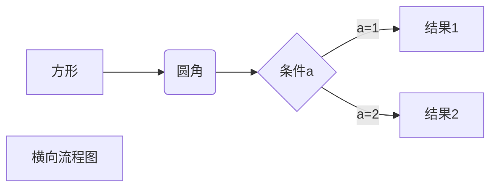

# 我是c

fafe
### aaa
fawefw

```
console.log(123)
```




# 我是c

fafe
### aaa
fawefw

```
console.log(123)
```


# 我是c

fafe
### aaa
fawefw

```
console.log(123)
```


# 我是c

fafe
### aaa
fawefw

```
console.log(123)
```


# 我是c

fafe
### aaa
fawefw

```
console.log(123)
```


# 我是c

fafe
### aaa123
fawefw

```
console.log(123)
```


# 我是c

fafe
### aaa
fawefw

```
console.log(123)
```


# 我是c

fafe
### aaa
fawefw

```
console.log(123)
```


# 我是c

fafe
### aaa
fawefw

```
console.log(123)
```


# 我是c

fafe
### aaa
fawefw

```
console.log(123)
```


# 我是c

fafe
### aaa
fawefw

```
console.log(123)
```


# 我是c

fafe
### aaa123
fawefw

```
console.log(123)
```


# 我是c

fafe
### aaa
fawefw

```
console.log(123)
```


# 我是c

fafe
### aaa
fawefw

```
console.log(123)
```


# 我是c

fafe
### aaa
fawefw

```
console.log(123)
```


# 我是c

fafe
### aaa
fawefw

```
console.log(123)
```


# 我是c

fafe
### aaa
fawefw

```
console.log(123)
```


# 我是c

fafe
### aaa123
fawefw

```
console.log(123)
```


# 我是c

fafe
### aaa
fawefw

```
console.log(123)
```


# 我是c

fafe
### aaa
fawefw

```
console.log(123)
```


# 我是c

fafe
### aaa
fawefw

```
console.log(123)
```

```mermaid
graph LR
A[方形] -->B(圆角)
    B --> C{条件a}
    C -->|a=1| D[结果1]
    C -->|a=2| E[结果2]
    F[横向流程图]
```


# 我是c

fafe
### aaa
fawefw

```
console.log(123)
```

```mermaid
graph LR
A[方形] -->B(圆角)
    B --> C{条件a}
    C -->|a=1| D[结果1]
    C -->|a=2| E[结果2]
    F[横向流程图]
```


# 我是c

fafe
### aaa
fawefw

```
console.log(123)
```

```mermaid
graph LR
A[方形] -->B(圆角)
    B --> C{条件a}
    C -->|a=1| D[结果1]
    C -->|a=2| E[结果2]
    F[横向流程图]
```


# 我是c

fafe
### aaa123
fawefw

```
console.log(123)
```

```mermaid
graph LR
A[方形] -->B(圆角)
    B --> C{条件a}
    C -->|a=1| D[结果1]
    C -->|a=2| E[结果2]
    F[横向流程图]
```


# 我是c

fafe
### aaa
fawefw

```
console.log(123)
```

```mermaid
graph LR
A[方形] -->B(圆角)
    B --> C{条件a}
    C -->|a=1| D[结果1]
    C -->|a=2| E[结果2]
    F[横向流程图]
```


# 我是c

fafe
### aaa
fawefw

```
console.log(123)
```

```mermaid
graph LR
A[方形] -->B(圆角)
    B --> C{条件a}
    C -->|a=1| D[结果1]
    C -->|a=2| E[结果2]
    F[横向流程图]
```


# 我是c

fafe
### aaa
fawefw

```
console.log(123)
```

```mermaid
graph LR
A[方形] -->B(圆角)
    B --> C{条件a}
    C -->|a=1| D[结果1]
    C -->|a=2| E[结果2]
    F[横向流程图]
```


# 我是c

fafe
### aaa
fawefw

```
console.log(123)
```

```mermaid
graph LR
A[方形] -->B(圆角)
    B --> C{条件a}
    C -->|a=1| D[结果1]
    C -->|a=2| E[结果2]
    F[横向流程图]
```


# 我是c

fafe
### aaa
fawefw

```
console.log(123)
```

```mermaid
graph LR
A[方形] -->B(圆角)
    B --> C{条件a}
    C -->|a=1| D[结果1]
    C -->|a=2| E[结果2]
    F[横向流程图]
```


# 我是c

fafe
### aaa123
fawefw

```
console.log(123)
```

```mermaid
graph LR
A[方形] -->B(圆角)
    B --> C{条件a}
    C -->|a=1| D[结果1]
    C -->|a=2| E[结果2]
    F[横向流程图]
```


# 我是c

fafe
### aaa
fawefw

```
console.log(123)
```

```mermaid
graph LR
A[方形] -->B(圆角)
    B --> C{条件a}
    C -->|a=1| D[结果1]
    C -->|a=2| E[结果2]
    F[横向流程图]
```


# 我是c

fafe
### aaa
fawefw

```
console.log(123)
```

```mermaid
graph LR
A[方形] -->B(圆角)
    B --> C{条件a}
    C -->|a=1| D[结果1]
    C -->|a=2| E[结果2]
    F[横向流程图]
```


# 我是c

fafe
### aaa
fawefw

```
console.log(123)
```

```mermaid
graph LR
A[方形] -->B(圆角)
    B --> C{条件a}
    C -->|a=1| D[结果1]
    C -->|a=2| E[结果2]
    F[横向流程图]
```


# 我是c

fafe
### aaa
fawefw

```
console.log(123)
```

```mermaid
graph LR
A[方形] -->B(圆角)
    B --> C{条件a}
    C -->|a=1| D[结果1]
    C -->|a=2| E[结果2]
    F[横向流程图]
```


# 我是c

fafe
### aaa
fawefw

```
console.log(123)
```

```mermaid
graph LR
A[方形] -->B(圆角)
    B --> C{条件a}
    C -->|a=1| D[结果1]
    C -->|a=2| E[结果2]
    F[横向流程图]
```


# 我是c

fafe
### aaa123456
fawefw

```
console.log(123)
```

```mermaid
graph LR
A[方形] -->B(圆角)
    B --> C{条件a}
    C -->|a=1| D[结果1]
    C -->|a=2| E[结果2]
    F[横向流程图]
```


